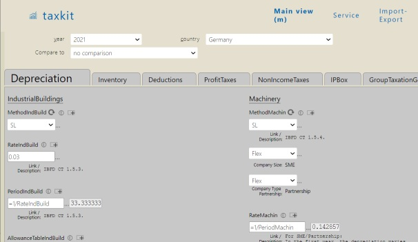

# Projects up to 2019

## ExcelDB - tax parameter database (2016-)

* Excel in the web browser:  
sheets with cells;  
numbers, formulas, computations, cell comments

* Additional features
  * Sheets can be organized in trees
  * `Diff` view for sheets
  * Versioning of sheets over years, countries etc.
  * Sheets have a user definable structure for specific types of data
  * LDAP login
  * Change log
  * Import from Excel - export to Excel
  * SQL queries - highly normalized DB schema
  * Formulas are compatible to Excel;  
    special functions for taxation  
    (NPV of deduction schemes...)

* Used at [ZEW institute](https://www.zew.de/)...
  * For taxation parameters of 20+ countries and 40+ special tax jurisdictions
  * Over 25 years into the past
  * Parameters for income tax, profit tax, substance- and local tax

* Written in [Golang](https://golang.org/) with under 14.000 LOC

* Closed source

## [Bitcoin micropayments for small websites](https://github.com/pbberlin/ae_stubs/tree/master/tec_news) (2015)

* An [app engine website](https://cloud.google.com/appengine/) serving HTTP content from [Google cloud datastore](https://cloud.google.com/datastore/)

* Using Google identity toolkit (gitkit) version 1 for social media logins

* Using the bitcoin transaction API of [coinbase.com](https://www.coinbase.com)  
to purchase premium content; saving article purchases in the cloud datastore

* By 2018, all components of the website had become obsolete.  
Gitkit no longer exists.  
App engine architecture for Golang has changed.  

* Result 1: Bitcoin transactions took up to 2 hours

* Result 2: Bitcoin transactions had to be _tipped_ in order to get executed

* Result 3: Bitcoin transactions are not suited for micropayments under one Dollar

* Result 4: Bitcoin and other blockchain based systems are subject to the [CAP theorem](https://en.wikipedia.org/wiki/CAP_theorem)

## Graphite monitoring service (2015)

* Right before [Prometheus](https://prometheus.io/docs/introduction/overview/) came into existence,  
I was tasked to setup a central monitoring service at [Idealo Internet Ltd](https://www.idealo.de/).  
The company decided on [Graphite](http://graphiteapp.org/).

* Lots of advance testing and preparation

* Rolling out the Nagios configs to 1000+ machines  
  using [puppet](https://puppet.com/)

* Collecting monitoring data from 1000+ Linux servers

* Common Linux parameters and specific measures  
  for MySQL servers, Java webservers etc.

* Batches of measures every five minutes, partly every minute

* Compacting time series databases after four weeks  
and further after one year is essential to maintain performance

* The Python scripts in the Graphite Ceres storage engine  
doing the compacting needed some actual implementation;  
but I am sure, everything is perfect by now

* Setting up ten Python data collector processes  
doing the persisting of up to 100.000 measures per second (benchmarked)

* Still only one initial listener socket, distributing the incoming data

* Result 1: Really nice graphite-web charts - and SMS alarms

* Result 2: The mysterious `mysqld` crashes every nine months remained mysterious

* Result 3: Python on the server is cumbersome

## MySQL master-master cluster (2015)

* Another go at improving the huge  
master-slave database systems at [Idealo Internet Ltd](https://www.idealo.de/)

* Trying a [master-master clustering system](https://www.percona.com/software/mysql-database/percona-xtradb-cluster):  
`Percona Galera XtraDB cluster`

* Using [HaProxy](https://www.haproxy.org/) as load balancer

* [Setup and config guide](./percona-galera-cluster-config/percona-galera-cluster-config.pdf) - partly in German

* Result 1: Automatic failover traded in for reduced write performance

* Result 2: `rejoining` a broken node is cumbersome

## [mongo-stress](https://github.com/pbberlin/mongo-stress) (2014)

* Large cloud setup to investigate the scaling of [MongoDB](https://www.mongodb.com) clusters  
under various types of loads for [Idealo Internet Ltd](https://www.idealo.de/)

* Cluster of three [MongoDB](https://www.mongodb.com) nodes

* Four MongoDB clients, performing inserts, updates and deletes

* All operations summarized in [highcharts webbrowser](https://www.highcharts.com/) view

* First use of [Golang](https://golang.org/) for synchronizing lots of parallel data streams  
via `channels` and `for` &#8230; `select` &#8230; loops

* Insertion performance using monotonically increasing IDs versus GUIDs

* Result 1: MongoDB scales linearly for GUID based insertions,  
because those are equally distributed across nodes.  
Monotonically increasing IDs dont scale.  

* Result 2: No re-balancing of sparse/emptied `chunks`  
between nodes, possibly not implemented then  
=> skewed load when monotonically increasing IDs are deleted after a while

* Result 3: Fitting the `hot set` into memory for each node dominates perfomance;  
and so are the Linux hard disk flushing settings

* Result 4: Good luck with restoring your cluster once its broken

* Result 5: GUIDs are partly based on the client's MAC address;  
watch out for skewered loads...

## Apartment sharing sites (2010-2012)

* [Holiday apartments in several cities](http://mowitania.de/)

* [HTML map/shape - multiselect city districts](http://www.ferienwohnung-zimmer-berlin.de/)

* Dynamic ranking of apartment result list,  
based on recent revenue and Google analytics

* SEO despair

---

[Home](README.md)
