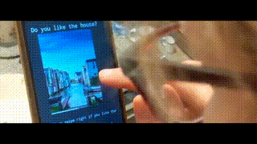
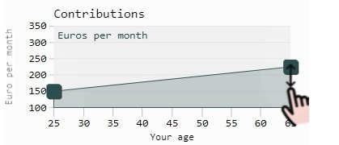

# Projects 2020

## [Drag'n Drop for smartphones](./js-drag/drag.html)

  

<!--  -->

* Drag and drop on IPhones, Android phones _and_ desktop web browsers

* Using HTML + Javascript: [Demo](./js-drag/drag.html)

* Same functionality meanwhile available via [Apache E-Charts](https://echarts.apache.org/v4/examples/en/editor.html?c=line-draggable)

## [Price of beauty in real estate](https://4walls.cremll.com)

<!-- * Using machine learning to measure the  
  market valuation of house aesthetics
 -->

* Pricing real estate beauty via smartphone app

* Cooperation between ZEW and [Cambridge Real Estate Lab](https://cremll.com/)  
  founded by Doctor Thies Lindenthal

* Social media login via [Google Sign-In](https://developers.google.com/identity/sign-in/web/sign-in)

* [AWS](https://aws.amazon.com/de/) backend with [PostgreSQL](https://www.postgresql.org/)

* [Apache](https://httpd.apache.org/), mod_wsgi

* Python [Flask](https://github.com/pallets/flask/), [SQLAlchemy](https://www.sqlalchemy.org/) -  
  expandable by researchers

<!-- 

* TensorFlow

* [Short video](./2019-cremll/do-you-like-this-house-532717698.mp4)
 -->

* [Try it online](https://4walls.cremll.com/)

## [Retirement saving as smartphone app](https://rent-o-mat.appspot.com/)  

* A prototype => [it's ugly](https://rent-o-mat.appspot.com/)

* Smartphone simulation - again using drag and drop

* Long term savings in stocks and bonds  

* Payout based on Monte Carlo simulation of historical returns

* Auto scaling via [Google app engine](https://rent-o-mat.appspot.com/)

* Design by [software engineer](https://dilbert.com/strip/2002-09-23)

## [Keyboard shortcuts](keyboard-shortcuts-windows-and-total-commander.pdf)

* For `Windows`, `Webbrowser` and `Total Commander`

* [PDF (in German)](keyboard-shortcuts-windows-and-total-commander.pdf)

---

[Home](README.md)
